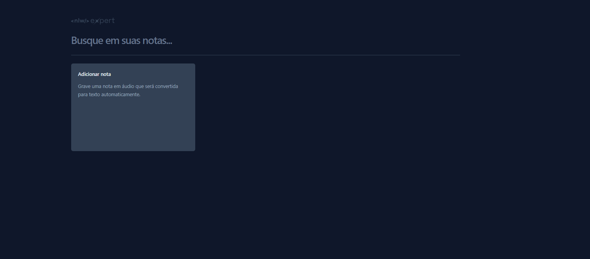
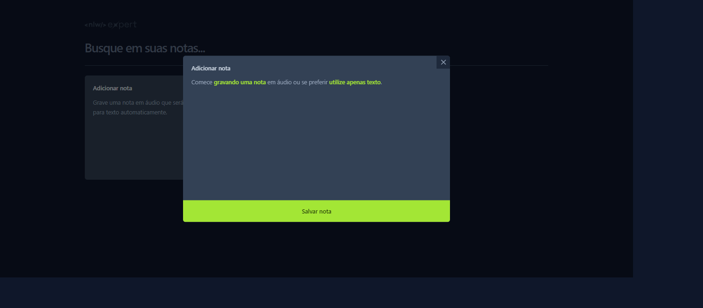

# Expert Notes

Expert Notes é uma aplicação web desenvolvida para criar notas através de textos digitados ou descrições de textos via áudio. Além disso, oferece a funcionalidade de pesquisa para encontrar notas previamente criadas.

## Tecnologias Utilizadas

- **React com TypeScript**: O frontend da aplicação foi construído utilizando React, um framework JavaScript popular, e TypeScript, uma linguagem de programação tipada para JavaScript, proporcionando maior segurança e escalabilidade ao código.
- **Tailwind CSS**: Para estilização, foi utilizado o Tailwind CSS, um framework CSS utilitário que permite criar rapidamente estilos personalizados com classes pré-definidas.
- **JavaScript**: Para a lógica da aplicação e interações com o navegador, foi utilizado JavaScript.
- **Web Storage API**: A aplicação faz uso da Web Storage API para armazenar localmente as notas criadas pelo usuário, permitindo que sejam acessadas posteriormente mesmo após o fechamento do navegador.
- **Web Speech API**: Utilizando a Web Speech API, é possível realizar a entrada de texto através de comandos de voz, proporcionando uma experiência mais acessível e prática para o usuário.

## Funcionalidades

- **Criação de Notas**: Permite ao usuário criar novas notas digitando texto ou fornecendo descrições via áudio.
- **Pesquisa de Notas**: Oferece a funcionalidade de pesquisa para encontrar notas existentes com base em palavras-chave ou termos específicos.
- **Armazenamento Local**: As notas criadas são armazenadas localmente no navegador do usuário, garantindo que estejam disponíveis para acesso posterior mesmo sem conexão com a internet.
- **Entrada de Texto por Voz**: Através da Web Speech API, é possível inserir texto nas notas utilizando comandos de voz.

## Como Executar

Para executar a aplicação localmente, siga os passos abaixo:

1. **Clonar o Repositório**: Clone este repositório em sua máquina local utilizando o seguinte comando:

   ```
   git clone https://github.com/gabrielnobrel/expertNotes.git
   ```

2. **Instalar Dependências**: Navegue até o diretório do projeto e instale as dependências utilizando o npm ou yarn:

   ```
   cd expertNotes
   npm install
   ```

   ou

   ```
   cd expertNotes
   yarn install
   ```

3. **Iniciar o Servidor de Desenvolvimento**: Após a instalação das dependências, inicie o servidor de desenvolvimento com o seguinte comando:

   ```
   npm start
   ```

   ou

   ```
   yarn start
   ```

4. **Acessar a Aplicação**: Acesse a aplicação no seu navegador através do seguinte endereço:

   ```
   http://localhost:3000
   ```

## Screenshots

<div style="display: flex; justify-content: space-around;">
    
    
</div>

## Contribuição

Contribuições são bem-vindas! Sinta-se à vontade para abrir issues para reportar problemas, sugerir melhorias ou enviar pull requests para contribuir com o código.

Se você está reportando um problema, por favor, inclua o máximo de informações possível para que possamos entender e resolver o problema mais rapidamente.

## 👽Contato

gabriel_nobresantos@hotmail.com
